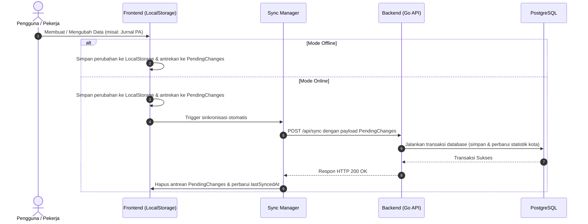

# Sion Academy

Sion Academy adalah platform manajemen dan pemantauan pemuridan (discipleship tracking) yang dirancang khusus untuk para pekerja **Sion Ministry**. Aplikasi ini menggunakan pendekatan **offline-first**, yang memungkinkan pengguna untuk tetap menginput data pelayanan di daerah terpencil tanpa koneksi internet, lalu menyinkronkannya kembali ketika koneksi tersedia.

---

## 🚀 Fitur Utama

1. **Dashboard Statistik**: Memantau perkembangan jemaat, berita acara, jurnal PA, dan statistik kota secara real-time.
2. **Manajemen Anggota (Members)**: Melacak status jemaat, tahap pemuridan (discipleship stage), serta hubungan mentor-mentee.
3. **Berita Acara**: Pencatatan aktivitas pelayanan, jumlah kehadiran, dokumentasi foto, dan deskripsi kegiatan.
4. **Jurnal PA (Pendalaman Alkitab)**: Catatan refleksi pribadi, ayat fokus, catatan bimbingan, dan gambar pendukung.
5. **Modul Pemuridan (Discipleship Modules)**: Kurikulum pemuridan digital dengan kategori, target pembacaan, dan status penyelesaian.
6. **Crowdfunding Misi (Donations)**: Penggalangan dana misi, pencatatan donatur, target kampanye, dan simulasi pembayaran.
7. **Papan Pekerjaan (Job Opportunities)**: Informasi lowongan pelayanan/pekerjaan misi, aplikasi pelamar, dan detail tugas.
8. **Asisten AI (Sion AI)**: Konsultasi teologi praktis dan materi pemuridan berbasis kecerdasan buatan terintegrasi dengan Google Gemini.

---

## 🛠️ Tech Stack (Teknologi yang Digunakan)

### Frontend (FE)
* **React 19**: SPA framework modern dengan performa tinggi.
* **Vite 6**: Tooling build super cepat untuk frontend modern.
* **Tailwind CSS v4**: Utility-first CSS framework untuk antarmuka yang modern, responsif, dan rapi.
* **Motion (Framer Motion)**: Untuk animasi transisi antar-halaman dan efek mikro yang mulus.
* **Lucide React**: Paket ikon berbasis SVG yang konsisten dan modern.
* **LocalStorage (SionDatabase)**: Penyimpanan data lokal untuk mendukung kemampuan offline-first sebelum disinkronkan ke server.

### Backend (BE)
* **Go (Golang) 1.25.4**: Bahasa pemrograman backend yang cepat, efisien, dan andal.
* **Fiber v2**: Web framework Go dengan performa tinggi (mirip Express.js).
* **GORM**: Object-Relational Mapper (ORM) Go yang memudahkan interaksi dengan database.
* **Go Embed**: Menyematkan file migrasi SQL direktori secara native ke dalam binary kompilasi.

### Database (DB)
* **PostgreSQL 15+**: Sistem database relasional yang tangguh untuk menyimpan data operasional.
* **Manual SQL Migrations**: Kontrol skema DB secara terstruktur yang dilacak otomatis oleh tabel `schema_migrations`.

### Integrasi AI & Eksternal
* **Google Gemini API**: Model `gemini-3.5-flash` sebagai mesin pemrosesan teks pada fitur Asisten AI.

---

## 📊 Diagram Arsitektur & Aliran Teknologi

Berikut adalah visualisasi bagaimana frontend, backend, database, dan layanan AI berinteraksi satu sama lain dalam arsitektur offline-first:

```mermaid
graph TD
    %% Define Nodes
    subgraph Client ["Frontend (React SPA - Offline-First)"]
        UI["React UI Components<br>(Dashboard, Members, AI Assistant, etc.)"]
        LocalDB[("SionDatabase<br>(LocalStorage Cache)")]
        SyncManager["Sync Manager<br>(Pending Changes Queue)"]
    end

    subgraph Server ["Backend (Go API Server - Clean Layer)"]
        Router["Fiber Router & Middlewares"]
        Handlers["HTTP Handlers (Delivery Layer)"]
        Services["Service Layer<br>(Sync, Member, AI, etc.)"]
        Repos["Repository Layer<br>(GORM DB Operations)"]
    end

    subgraph DB ["Data Store"]
        Postgres[(PostgreSQL Database)]
    end

    subgraph External ["External Services"]
        Gemini["Google Gemini API<br>(gemini-3.5-flash)"]
    end

    %% Flows & Interactions
    UI <-->|Membaca & Menyimpan Data| LocalDB
    UI -->|Menambahkan Perubahan| SyncManager
    
    %% Sync Path
    SyncManager -->|1. POST /api/sync<br>(Kirim Perubahan Pending)| Router
    Router --> Handlers
    Handlers --> Services
    Services --> Repos
    Repos -->|2. Tulis Data & Update Statistik Kota| Postgres
    
    %% Standard HTTP Path
    UI -->|Pencarian / Fetch Data Awal| Router
    
    %% AI Path
    UI -->|3. Kirim Prompt Asisten| Router
    Services -->|4. HTTP POST Request| Gemini
    Gemini -.->|5. Kembalikan Jawaban AI| Services
```

---

## 🔄 Cara Kerja Sinkronisasi (Offline-First Flow)



---

## 📁 Struktur Direktori Proyek

```text
sion-academy/
├── backend/                  # Kode Backend (Go)
│   ├── config/               # Konfigurasi aplikasi (.env loader)
│   ├── internal/
│   │   ├── database/         # Inisialisasi DB & Migrasi SQL
│   │   │   └── migrations/   # File SQL migrasi schema (.up.sql / .down.sql)
│   │   ├── delivery/         # Layer HTTP (Router & Handlers)
│   │   ├── models/           # Go Structs untuk entitas DB & API
│   │   ├── repository/       # Data Access Layer (GORM queries)
│   │   └── service/          # Business Logic Layer (termasuk AI & Sync)
│   ├── main.go               # Entrypoint utama Backend
│   └── go.mod                # Dependency manager Go
├── frontend/                 # Kode Frontend (React)
│   ├── src/
│   │   ├── components/       # Komponen UI Halaman (Dashboard, Members, dll.)
│   │   ├── data/             # Mock data inisialisasi awal aplikasi
│   │   ├── utils/            # Utilitas (termasuk SionDatabase untuk LocalStorage & Sync)
│   │   ├── App.tsx           # Layout & Routing utama aplikasi
│   │   └── main.tsx          # Entrypoint React
│   ├── vite.config.ts        # Konfigurasi build Vite
│   └── package.json          # Dependency manager JavaScript
└── README.md                 # Dokumentasi utama proyek (file ini)
```

---

## 🛠️ Panduan Menjalankan Proyek Secara Lokal

### Prerequisites (Prasyarat)
* **Go** versi 1.25 atau lebih baru
* **Node.js** versi 18 atau lebih baru
* **PostgreSQL** versi 15 atau lebih baru

---

### Langkah 1: Setup Database PostgreSQL
Pastikan database PostgreSQL Anda berjalan secara lokal pada port default `5432`.
1. Masuk ke console PostgreSQL Anda dan buat database baru bernama `sion_ministry` (atau backend akan mencoba membuatnya otomatis jika user memiliki kewenangan).
2. Kredensial default yang terkonfigurasi pada backend adalah:
   * **Host**: `localhost`
   * **Port**: `5432`
   * **User**: `postgres`
   * **Password**: `postgres`
   * **Database**: `sion_ministry`

---

### Langkah 2: Menjalankan Backend (Go)
1. Buka terminal baru dan masuk ke direktori backend:
   ```bash
   cd backend
   ```
2. Buat file konfigurasi `.env` dari contoh yang tersedia:
   ```bash
   cp .env.example .env
   ```
3. Sesuaikan konfigurasi database jika kredensial PostgreSQL lokal Anda berbeda dari nilai default.
4. *(Opsional)* Dapatkan API Key Gemini dari Google AI Studio dan tambahkan ke berkas `.env` Anda untuk mengaktifkan fitur Asisten AI:
   ```env
   GEMINI_API_KEY=your_gemini_api_key_here
   ```
5. Jalankan aplikasi backend:
   ```bash
   go run main.go
   ```
   Backend akan berjalan di port `3000` (atau port lain yang Anda tetapkan di `.env`). Backend secara otomatis menjalankan migrasi SQL untuk membuat tabel-tabel yang diperlukan dan memasukkan data sampel inisiasi (seeding).

---

### Langkah 3: Menjalankan Frontend (React + Vite)
1. Buka terminal baru yang lain dan masuk ke direktori frontend:
   ```bash
   cd frontend
   ```
2. Instal semua dependensi Node.js:
   ```bash
   npm install
   ```
3. Jalankan server pengembangan lokal (Vite):
   ```bash
   npm run dev
   ```
4. Buka peramban (browser) Anda dan akses alamat URL yang tampil di terminal (biasanya `http://localhost:5173`).