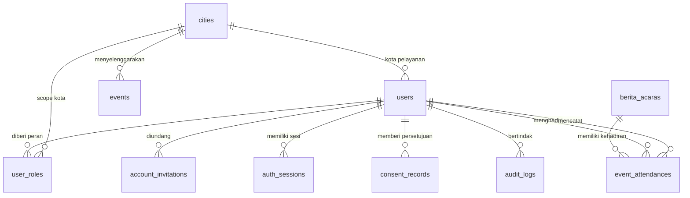

# Rancangan Database Sion yang Sederhana dan Aman

Dokumen ini adalah rancangan target untuk domain identitas, anggota, akses, undangan akun, kehadiran, dan audit. Implementasinya tersedia pada migration `000007_simplify_identity_city_scope`; jalankan hanya setelah data legacy direkonsiliasi, backup dan restore diuji. UAT ada di [Panduan Manual Testing Identitas dan Undangan](../manual_testing/04-testing-identitas-undangan-scope-kota.md).

## Keputusan rancangan

Satu orang hanya mempunyai satu identitas kanonis: satu row pada `users`. Dalam Sion, setiap anggota dibuat sebagai `users` sejak awal dengan status akun `invited`; tidak ada lagi tabel `members` yang menyimpan nama, kota, email, atau telepon yang sama. Ketika penerima menyelesaikan aktivasi, row yang sama menjadi `active` dan dapat login.

Kota adalah satu-satunya scope organisasi. Administrator mempunyai scope global; pekerja/mentor mempunyai scope satu atau lebih kota. Tidak ada `organizations`, `ministry_units`, maupun `regions`.



## Mengapa tabel saat ini ada

| Tabel saat ini | Fungsi aslinya | Penilaian |
| --- | --- | --- |
| `attendance_checkins` | Relasi banyak-ke-banyak antara kegiatan dan anggota; mencegah anggota dicheck-in dua kali pada kegiatan yang sama. | Tetap dibutuhkan bila fitur kehadiran dipakai. Kosong karena belum ada check-in sukses; migrasi tidak boleh mengisi data contoh. Ganti nama menjadi `event_attendances` dan gunakan `user_id`; `city_id` tidak perlu disalin karena sudah ada pada event. |
| `members` | Profil anggota/pemuridan. | Bertumpang-tindih dengan `users` karena keduanya menyimpan identitas orang. Hapus setelah seluruh anggota dibackfill menjadi user. |
| `member_histories` | Riwayat perubahan profil anggota. | Berguna untuk audit, tetapi dapat digantikan oleh `audit_logs` yang append-only dan terstandar. |
| `member_consent_histories` | Bukti persetujuan komunikasi/data. | Tujuannya benar dan sebaiknya tetap ada, tetapi ringkas menjadi `consent_records`; jangan menyimpan status consent yang sama lagi di `users`. Status aktif dihitung dari record persetujuan terakhir. |
| `member_duplicate_reviews` | Antrean keputusan saat kandidat anggota duplikat ditemukan. | Bukan tabel user kedua, tetapi workflow kualitas data. Untuk MVP dapat diganti dengan validasi sebelum undangan + audit. Jika antrean memang diperlukan nanti, gunakan satu tabel generik `data_quality_cases`, bukan tabel khusus anggota. |
| `users` | Kredensial, status akun, dan role lama. | Menjadi sumber data utama satu orang. Kolom `role`, `city_name`, dan data profil duplikat harus dipindahkan/diakhiri. |
| `organizations`, `ministry_units`, `regions` | Hirarki RBAC yang dibuat untuk kebutuhan multi-level. | Tidak sesuai kebutuhan saat ini dan membuat query/otorisasi lebih rumit. Hapus bersama FK serta scope terkait setelah migrasi. |

## Skema target

Semua primary key memakai `UUID`; waktu memakai `TIMESTAMPTZ`, sedangkan tanggal tanpa jam memakai `DATE`. Tidak ada lagi tanggal sebagai `TEXT`, `city_name` yang disalin, `joined_date`/`joined_on` ganda, atau `primary_service_point_id` yang sama maknanya dengan `city_id`.

### 1. `cities`

Master kota, tidak memiliki counter yang disalin dari tabel lain.

```text
id UUID PK
name TEXT NOT NULL UNIQUE
province TEXT NULL
is_active BOOLEAN NOT NULL DEFAULT true
created_at TIMESTAMPTZ NOT NULL
updated_at TIMESTAMPTZ NOT NULL
```

`members_count`, `journals_count`, dan counter lain dihapus. Dashboard menghitung dengan query/index atau materialized view yang dapat direfresh; counter manual mudah drift dan saat ini `journals_count` bahkan dihitung dari dua sumber.

### 2. `users` - satu sumber data orang dan akun

```text
id UUID PK
full_name TEXT NOT NULL
email CITEXT NOT NULL UNIQUE
phone_e164 TEXT NOT NULL
city_id UUID NOT NULL FK -> cities(id) ON DELETE RESTRICT
discipleship_stage TEXT NULL
mentor_user_id UUID NULL FK -> users(id) ON DELETE SET NULL
group_name TEXT NULL
member_status TEXT NOT NULL
    CHECK (member_status IN ('guest','prospect','active','inactive','moved','deceased','archived'))
account_status TEXT NOT NULL
    CHECK (account_status IN ('invited','active','disabled'))
password_hash TEXT NULL
activated_at TIMESTAMPTZ NULL
email_verified_at TIMESTAMPTZ NULL
archived_at TIMESTAMPTZ NULL
created_at TIMESTAMPTZ NOT NULL
updated_at TIMESTAMPTZ NOT NULL
```

`email` wajib karena proses aktivasi membutuhkan alamat email. `phone_e164` adalah nilai kanonis, misalnya `+628123456789`; ia bukan salinan dari kolom phone lain. Nomor telepon tidak perlu `UNIQUE` karena keluarga dapat berbagi nomor, tetapi pendaftaran harus memberi peringatan bila nama/nomor mirip. `email` unik secara case-insensitive dengan `CITEXT`.

Tidak ada endpoint publik untuk membuat akun. Hanya actor dengan permission `user.invite` yang dapat membuat user baru. Jika suatu hari ada akun teknis yang benar-benar bukan anggota, buat sebagai pengecualian break-glass yang terdokumentasi - jangan membuka kembali dua sumber identitas.

### 3. `user_roles` - role dan scope kota

```text
id UUID PK
user_id UUID NOT NULL FK -> users(id) ON DELETE RESTRICT
role TEXT NOT NULL CHECK (role IN ('admin','pekerja','mentor','jemaat','auditor'))
city_id UUID NULL FK -> cities(id) ON DELETE RESTRICT
granted_by UUID NOT NULL FK -> users(id) ON DELETE RESTRICT
granted_at TIMESTAMPTZ NOT NULL
revoked_at TIMESTAMPTZ NULL
```

Aturan aplikasi dan constraint:

- `admin` memakai `city_id = NULL` dan berarti global.
- `pekerja`, `mentor`, dan `auditor` wajib mempunyai `city_id`.
- `jemaat` dibaca sebagai profilnya sendiri; ia tidak mendapat akses ke seluruh kota hanya karena memiliki `city_id`.
- Permission adalah peta statis yang ditinjau di kode (`role -> permission`); tabel `permissions` dan `role_permissions` tidak diperlukan untuk lima role yang stabil.
- Hanya boleh ada satu role aktif yang sama pada scope yang sama. Pada PostgreSQL 15+, gunakan unique constraint/index yang memperlakukan `NULL` sebagai sama (`NULLS NOT DISTINCT`) atau unique partial index yang ekuivalen.

Dengan ini `users.role`, `users.city_id` sebagai scope role, `role_assignments` dengan scope `organization/ministry_unit/region/self`, serta tiga tabel hirarki dihapus.

### 4. `account_invitations` - aktivasi yang aman

```text
id UUID PK
user_id UUID NOT NULL FK -> users(id) ON DELETE CASCADE
token_hash CHAR(64) NOT NULL UNIQUE
expires_at TIMESTAMPTZ NOT NULL
sent_at TIMESTAMPTZ NULL
used_at TIMESTAMPTZ NULL
revoked_at TIMESTAMPTZ NULL
created_by UUID NOT NULL FK -> users(id) ON DELETE RESTRICT
created_at TIMESTAMPTZ NOT NULL
```

Hanya satu undangan yang belum digunakan/dicabut untuk tiap user. Token mentah dibuat dari CSPRNG minimal 32 byte, hanya token mentah yang dikirim melalui email HTTPS, dan database hanya menyimpan SHA-256-nya. Link tidak boleh memuat email, user ID, role, maupun password.

### 5. `auth_sessions`

```text
id UUID PK
user_id UUID NOT NULL FK -> users(id) ON DELETE CASCADE
token_hash CHAR(64) NOT NULL UNIQUE
created_at TIMESTAMPTZ NOT NULL
last_seen_at TIMESTAMPTZ NOT NULL
expires_at TIMESTAMPTZ NOT NULL
revoked_at TIMESTAMPTZ NULL
revoked_by UUID NULL FK -> users(id) ON DELETE SET NULL
revoke_reason TEXT NULL
ip_prefix INET NULL
user_agent TEXT NULL
```

`revoked_at = NULL` berarti sesi masih aktif. Jika sesi dicabut, isi timestamp, actor, dan alasan; jangan menghapusnya saat itu juga. Sesi yang sudah kedaluwarsa/dicabut baru dipurge menurut kebijakan retensi. Ini menjaga jejak audit dan membuat daftar sesi aktif cukup memakai `WHERE revoked_at IS NULL AND expires_at > now()`.

### 6. `berita_acaras` (kegiatan) dan `event_attendances`

`events` menggantikan nama teknis `berita_acaras` bila tim menyetujui rename. Setiap event mempunyai satu `city_id`. Kehadiran cukup berisi `event_id`, `user_id`, `checked_in_by_user_id`, dan `checked_in_at`, dengan `UNIQUE (event_id, user_id)`. Kota diturunkan dari event sehingga tidak ada `city_id` ganda yang dapat tidak konsisten.

### 7. `consent_records` dan `audit_logs`

`consent_records` adalah bukti append-only setiap perubahan consent: `id`, `user_id`, `status`, `channels`, `purpose`, `source`, `recorded_at`, dan `recorded_by`. Jangan update/delete row consent. Status consent saat ini didapat dari record terbaru atau view `current_consents`, sehingga tidak ada ringkasan status kedua yang bisa berbeda.

`audit_logs` mencatat operasi keamanan dan perubahan penting: `id`, `actor_user_id`, `action`, `entity_type`, `entity_id`, `outcome`, `request_id`, `ip_prefix`, `metadata_redacted`, `created_at`. Metadata tidak boleh menyimpan password, token, hash password, alamat lengkap, atau isi jurnal sensitif. Batasi operasi aplikasi menjadi insert-only dan ekspor audit dibatasi role auditor/admin.

## Alur admin menambah anggota dan aktivasi

1. Admin/pekerja yang memiliki scope kota mengisi nama, email, telepon E.164, kota, data pemuridan, dan role awal.
2. Backend memvalidasi input, memastikan actor memiliki scope kota, memeriksa email unik dan kandidat duplikat nama/telepon. Bila ada konflik, API memberi respons aman tanpa membocorkan data sensitif.
3. Dalam satu transaksi, backend membuat `users(account_status='invited', password_hash=NULL)`, `user_roles`, `account_invitations`, `consent_records` awal bila ada, dan `audit_logs`.
4. Layanan email mengirim kalimat pengantar dan tombol **Aktifkan Akun** ke URL frontend `https://app.sion.../activate?token=<token-acak>`.
5. Halaman aktivasi mengirim token dan password baru melalui HTTPS. Backend mengunci/menandai undangan dalam transaksi, memeriksa hash, kedaluwarsa, serta status pemakaian, lalu mengisi Argon2id password hash, `activated_at`, `email_verified_at`, dan `account_status='active'`.
6. Sistem menerbitkan session baru dan menulis audit. Token undangan tidak dapat dipakai ulang. Login sebelum aktivasi selalu ditolak dengan pesan generik.

Kirim ulang undangan berarti mencabut token lama lalu membuat token baru; endpoint selalu mengembalikan respons netral agar email tidak dapat dienumerasi oleh penyerang.

## Perbaikan keamanan yang wajib ikut dilakukan

- Pindahkan token dari `localStorage` ke cookie `__Host-sion_session` dengan `HttpOnly`, `Secure`, `SameSite=Strict`, `Path=/`; untuk request yang mengubah data tambahkan CSRF token dan validasi `Origin`/Fetch Metadata. OWASP secara eksplisit menyarankan agar credential tidak disimpan di local/session storage dan menganjurkan atribut cookie tersebut. [OWASP Session Management](https://cheatsheetseries.owasp.org/cheatsheets/Session_Management_Cheat_Sheet.html)
- Hash password menggunakan Argon2id dengan parameter yang dituning lewat benchmark server; jangan pernah menyimpan password mentah atau mengenkripsinya. bcrypt yang ada sekarang masih dapat dipertahankan sebagai format legacy lalu di-upgrade saat login. [OWASP Password Storage](https://cheatsheetseries.owasp.org/cheatsheets/Password_Storage_Cheat_Sheet.html)
- Rate-limit login, aktivasi, resend invitation, dan reset password per IP serta per identitas; gunakan pesan login generik dan audit setiap penolakan penting.
- Gunakan satu database role khusus aplikasi dengan privilege minimum; role migrasi terpisah, koneksi TLS, secret hanya dari environment/secret manager, backup terenkripsi, dan restore drill berkala.
- Validasi seluruh foreign key dan scope di backend; constraint database melindungi integritas, tetapi bukan pengganti otorisasi. Pertimbangkan Row-Level Security bila aplikasi nantinya diakses langsung oleh lebih dari satu service.
- Batasi PII di log, response, export, cache offline, dan analytics. Untuk mode offline, enkripsi storage perangkat atau hanya cache data yang memang diizinkan untuk actor tersebut.

## Rencana migrasi tanpa kehilangan data

1. Buat backup terenkripsi dan buktikan restore pada database terisolasi. Catat jumlah row serta foreign key sebelum migrasi.
2. Inventarisasi `members`: anggota tanpa email atau kota tidak boleh diberi email/kota palsu. Masukkan ke daftar resolusi data steward dan selesaikan sebelum cutover.
3. Tambahkan tabel target secara additive. Backfill satu row `users` per member yang sudah valid; untuk account lama, cocokan email secara eksplisit dan catat setiap konflik.
4. Migrasikan foreign key bisnis: `jurnal_pas.mentee_id` ke `mentee_user_id`, `attendance_checkins.member_id` ke `event_attendances.user_id`, serta seluruh referensi anggota lain ke `users.id`. Uji jumlah record dan relasi yang putus.
5. Rilis endpoint undangan/aktivasi dan ubah frontend. Nonaktifkan `POST /auth/register` publik dan alur approval yang meminta password sebelum diundang.
6. Ubah session menjadi timestamp nullable dan cookie aman. Cabut semua bearer token lama pada cutover agar format token lama tidak tersisa di `localStorage`.
7. Setelah aplikasi hanya membaca skema baru dan semua rekonsiliasi lulus, hapus `members`, `member_histories`, `member_consent_histories`, `member_duplicate_reviews`, `organizations`, `ministry_units`, `regions`, `permissions`, `role_permissions`, dan `role_assignments` melalui migrasi baru. Jangan mengedit atau menjalankan down migration lama pada database produksi.
8. Pantau error, audit, undangan gagal, dan hasil restore selama periode stabilisasi; baru hapus tabel legacy setelah retensi dan persetujuan data owner dipenuhi.

## Kriteria penerimaan sebelum implementasi dianggap selesai

- Tidak ada data identitas anggota yang berada di dua sumber aktif; satu orang dapat dicari lewat satu `users.id`.
- Semua anggota valid memiliki email, user berstatus `invited` atau `active`, dan tepat satu kota pelayanan.
- Tidak ada query atau UI yang lagi memakai organisasi/unit/region maupun `city_name` tersalin.
- Aktivasi token expired, token bekas, token salah, dan aktivasi bersamaan selalu ditolak; aktivasi sah hanya berhasil sekali.
- Sesi aktif selalu `revoked_at IS NULL`; revoke mengisi timestamp, tidak menghapus row langsung.
- Pengguna Kota A tidak dapat membuat, membaca, atau check-in data Kota B; admin global dapat diaudit.
- Token sesi tidak ditemukan di `localStorage`, response log, database plaintext, atau URL selain token aktivasi berumur pendek.
- Backup-restore, migrasi maju, uji rollback pada database disposable, dan tes integrasi seluruh alur undangan lulus.
